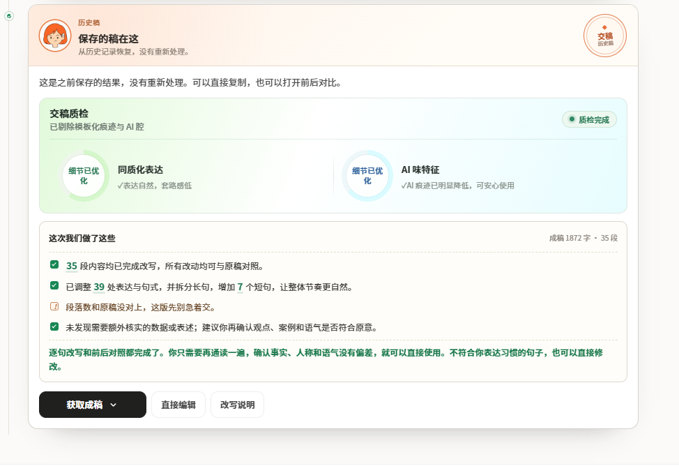
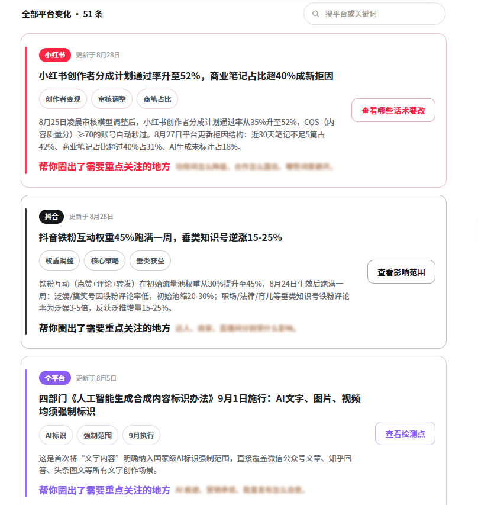

# 如何彻底去除AI写作痕迹？实测高效的去AI味方案

现阶段绝大多数内容创作者、自媒体从业者和文案写手，都会借助AI快速生成文章初稿，极大降低了内容创作的门槛、提升出稿效率。

但几乎所有人都会遇到同一个问题：AI生成的内容**机器痕迹很重**、同质化严重、真人感不足，很难彻底**去ai味**、**消除ai痕迹**。不仅读者阅读体验差，在各大内容平台还容易被判定为低质流水线内容，导致流量受限、账号权重下滑。

为了解决**ai痕迹重**的问题，我陆续测试过优化提示词、手动逐句润色、各类开源改写脚本、在线**去AI工具**等多种方案，目前看来，用好工具、实施好方案是最有效果的，这就把我的经验分享给大家。

## 一、深度拆解：AI稿件的机器痕迹，到底体现在哪里？

很多人只能直观感受到文章“不自然”，却无法精准定位问题，导致改稿效率极低，始终没办法彻底**去ai味**。其实AI生成文本有非常固定的标准化特征，这也是平台识别机器内容、我们需要重点**消除ai痕迹**的核心依据：

第一，**模板化过渡话术泛滥**。AI写作会高频复用固定衔接句式，例如“综上所述、值得注意的是、从多个维度来看、由此可见”，无论上下文是否需要，都会强行堆砌衔接，是最典型的机器写作特征。

第二，**句式结构过度规整刻板**。AI习惯输出对称排比、句式统一的文本，全文长句、短句高度趋同，整体文风偏向官方报告，生硬且僵硬。

第三，**内容空泛同质化严重**。稿件大多是通用型大道理，适配所有同主题内容，没有具体场景、实操经验、个人思考和真实案例，通篇都是无差错、无记忆点的“正确废话”，没有专属创作印记。

第四，**行文情绪极度中立扁平**。AI会刻意保持绝对客观中立，没有个人观点、主观判断、实操感慨和取舍思考，文字冰冷单薄，完全缺失真人写作的情绪温度。

第五，**段落排版高度统一**。全文段落行数、篇幅基本一致，排版规整得过于标准化，完全不符合真人写作长短错落、疏密自由的排版习惯。

以上问题叠加，就会导致AI稿件看似完美，实则流水线痕迹明显，很难获得平台流量和读者认可，我们就需要去**消除ai痕迹**。

## 二、传统去AI痕方法的核心短板

在使用工具打磨之前，我长期依赖手动改稿和提示词优化来**去ai味**，但这两种方式的短板非常明显，很难长期高效复用。

优化提示词只能从源头轻微弱化机器感，但AI生成随机性极强，同一套指令每次输出质量参差不齐，无法彻底杜绝模板句式，不能完全**消除ai痕迹**；手动逐句润色效果最好，但耗时费力，长篇稿件改稿成本极高，批量创作不适用；开源脚本去痕效果尚可，但无可视化界面、需要技术部署，普通创作者难以上手。

如果想要高效、稳定**消除ai痕迹**、彻底**去ai味**，工具辅助精细化打磨，是目前性价比最高、最落地的解决方案。

## 三、小橡皮AI工具实测：高效实现AI文稿真人化

传送门：[小橡皮](https://xiangpiai.cn/workspace?from=zhgxlw0818)[https://xiangpiai\.cn/](https://xiangpiai.cn/workspace?from=zhgxlw0818) 

区别于市面绝大多数仅支持同义词替换的低端改写工具，小橡皮AI是专门针对**中文AI写作特征**研发的润色去痕工具，主打高效**去ai味**、深度**消除ai痕迹**。核心逻辑是重构行文语感、优化句式结构，在百分百保留原创核心内容的前提下，彻底消解机器痕迹。

它的核心优势在于：**只优化文风与句式，不改观点、不改案例、不改核心逻辑**，完美解决工具改写容易跑偏、篡改原创内容的痛点，既能彻底**去ai味**，又能百分百保留创作者的原创核心。

## 四、完整实操流程：零基础快速去AI痕

工具全程网页端操作，无需下载部署、无需调试指令、无需技术基础，普通创作者可以直接上手，一键高效**消除ai痕迹**、自然**去ai味**：

**1、导入文稿，适配平台文风**

将AI生成的初稿完整粘贴至编辑器，根据自身创作场景，选择适配文风，涵盖公众号长文、知乎干货、小红书笔记、短视频文案等主流创作风格，精准匹配不同平台的读者阅读习惯。

**2、一键智能打磨，深度去机器化**

提交改写后，数十秒即可完成全篇优化，系统会自动识别并清理模板套话、生硬过渡句、机械排比，打散过于规整的固化句式，重新调整长短句交错的行文节奏，把标准化的机器文稿，打磨成松弛自然的真人手写风格，全方位**去ai味**、**消除ai痕迹**。

**3、可视化核对改动，自主把控稿件细节**

这是工具最核心的优势之一。改写完成后不会直接强制输出定稿，右侧成果面板会完整统计所有改动点位、优化数量，每一处调整都附带详细的优化说明，清晰展示句式整改、去痕优化的逻辑。遇到不符合个人写作风格的内容，支持页面就地微调、撤回修改，全程把控稿件质量，彻底避免工具盲目改写。

**4、合规风控扫描，规避平台限流风险**

除了**去AI痕迹功能**，工具自带自媒体刚需的全平台防限流体系，同步小红书、抖音、公众号、今日头条等平台最新规则。一键即可扫描全文，识别违禁词、导流话术、夸大宣传、敏感表述，按风险等级标注并给出适配上下文的合规替换方案，在优化文稿质感的同时，提前规避限流、降权、账号违规等问题。

**5、一键定稿导出，高效复用**

全文核对微调无误、确认无**残留AI痕迹**后，可直接一键复制文本使用，也可导出Word文档留存归档，极大降低人工改稿的时间成本。

## 五、总结：最优的AI文稿创作工作流

完全依赖AI出稿，**AI味重**、流量差，完全手动改稿，效率太低、耗时费力，结合实测体验，最均衡、最高效的创作流程是：

**AI快速生成初稿 \+ 小橡皮AI批量去痕润色 \+ 少量人工细节补充 \+ 合规风控校验 = 高质量真人化文稿**

AI负责搭建框架、填充内容，小橡皮AI负责高效**去ai味**、深度**消除ai痕迹**、优化行文质感、规避平台风险，人工负责补充个人思考和真实细节，三者结合，既能保证出稿效率，又能让内容自然真实，大家都可以去实操试一试！

